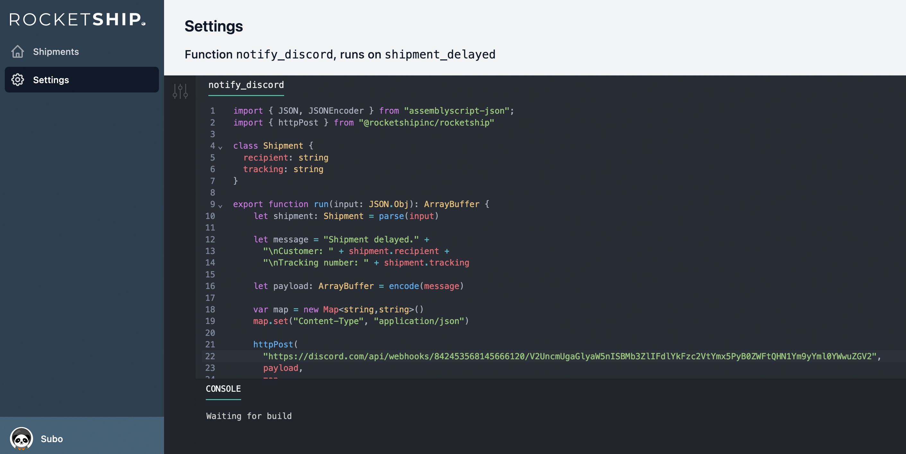

# Function editor

The Compute code editor is available for you to embed in your application, so your customers can build their functions quickly and easily:

The editor is hosted at `https://editor.suborbital.network`, and uses URL parameters to configure its connection to your builder service.

You will host the Compute [builder service](../concepts/data-plane-vs-control-plane.md) in your cloud infrastructure with a configured DNS name. In order to use the editor, an HTTPS connection to the builder is required.

To launch the editor, you can either embed it in a [frame](https://developer.mozilla.org/en-US/docs/Web/HTML/Element/iframe) within your own webpage, or launch it in a new tab.

## Editor token

To authenticate the editor for a specific user to edit their own functions, the `control-plane` service provides an API to create an `editor token` for a given function:

`http://local.suborbital.network:8081/api/v1/token/com.acmeco.gr9fas97234b/default/httpget`

When giving your users access to the editor, you must use an authenticated endpoint provided by your application server to fetch a token that is used to authenticate their editing session.

Full details for the token API are described in the [API Reference](../api-reference/api-reference.md) section.

## Configuration

The editor is configured with URL parameters. Here's an example:

`https://editor.suborbital.network?builder=https://builder.acmeco.com&token=K78as0aslwi30l8h5lbF4lS7&ident=com.suborbital.customer&fn=add-record`

Let's break it down:

**Builder**: `?builder=https://builder.acmeco.com`

* This is the URL of your builder service

**Token**: `&token=K78as0aslwi30l8h5lbF4lS7`

* The editor token retrieved from the control-plane service

**Ident**: `&ident=com.suborbital.customer`

* The identifier used when addressing your specific user, see [Fully-qualified function names](../concepts/fully-qualified-function-names.md) for more details

**Fn**: `&fn=add-record`

* The specific function name that the editor should load

**Namespace** (optional): `&namespace=default`

* The function namespace (if not included, the `default` namespace is used, see [Namespaces](../concepts/namespaces.md) for more details)

**Template** (optional): `&template=assemblyscript`

* The language template used for new functions. Currently, `assemblyscript` and `rust` are available (default `assemblyscript`), with more coming in future versions of Compute.

If the `fn` in question does not exist, the editor will automatically create a new function.

## Building and deploying

Once the customer has edited their function, the `build` button in the top right will allow them to check to ensure the function builds. The builder service will build the function and then return the results to the console area.

Assuming the build succeeds, the customer can choose to deploy the latest version with the `deploy` button. If they choose not to deploy, the draft will be available to them later.

Until the customer deploys the function, it will remain at the previous version. The [API Reference](../api-reference/api-reference.md) gives you details about the draft and active versions of any function.
